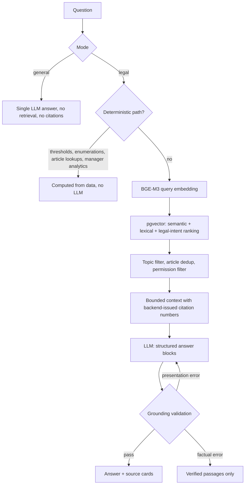

# Competition Law AI Assistant (Raqobat AI Assistant)

**A grounded, source-cited legal AI assistant for Uzbekistan's Competition Committee.**
It answers legal questions from the official statute base with article-level citations, analyses uploaded case documents, drafts official response letters as DOCX, and gives managers an operational dashboard — in Uzbek, without hallucinating law.

> 🇺🇿 O‘zbekcha to‘liq hujjat: **[docs/README.uz.md](docs/README.uz.md)**

**Stack:** Python 3.12 · FastAPI · PostgreSQL + pgvector · BAAI/bge-m3 embeddings · OpenAI-compatible LLM (self-hosted vLLM or Groq) · React 19 + TypeScript + Vite

---

## Why this project is interesting

Legal assistants fail in one specific way: they cite an article that does not say what they claim. This system is built so that **cannot reach the user**.

- **Every legal answer is traceable.** The response carries the document name, article number, official lex.uz link and the exact passage it relied on. Citation numbers are assigned by the backend, not by the model; a citation the backend did not issue invalidates the answer.
- **A grounding validator sits between the model and the user.** Every article number, figure (including spelled-out numbers such as *qirq foiz* and *30 000*), date, quotation and document title in the generated text is checked against the retrieved statute text. A presentation error earns one correction round; a factual error sends the user the verified passages instead of the generated prose.
- **Deterministic paths where determinism is better than generation.** Threshold questions (*"is a 45% market share dominant?"*), statutory enumerations (dominance criteria, fine rates), *"which article regulates X?"*, article counts and the manager's dashboard are computed from data, answered in well under a second, and cannot be wrong in the way an LLM can.
- **Uzbek-specific engineering.** Users ask in Latin script, the official law is in Cyrillic, answers must come back in Latin. Retrieval matches across scripts, stems agglutinative suffixes, and the output is transliterated and terminology-polished after validation.
- **Statute-aware indexing.** A law's closing articles amend other codes and quote their text; a naive chunker indexes those quotes as articles of *this* law. The chunker recognises real article headings only, so a fine-schedule question cannot be answered from the wrong code.
- **Provider-agnostic and quota-aware.** One OpenAI-compatible client serves a self-hosted vLLM (`gpt-oss-20b`) or Groq; a priority model pool fails over on rate limits, transient schema rejections are retried, verified answers are cached.
- **Security by design.** JWT with revocation, backend-enforced RBAC, confidential documents never leave the server for an external model, login throttling with a constant-time check, audit journal, upload type verification.

---

## Architecture

The system follows the architecture required by the technical assignment:

```
User
  ↓
Web interface        React + TypeScript (frontend/)
  ↓
Backend API          FastAPI, JWT, RBAC (backend/app/api.py)
  ↓
AI Agent             backend/app/services/ai_agent.py
   /        \
 RAG         LLM
  ↓           ↓
Statute DB  AI model      PostgreSQL + pgvector      vLLM (gpt-oss-20b) or Groq
        ↓
    AI answer          only evidence-verified text
```

### What happens to one legal question



### Components

| Layer | Files | Responsibility |
|---|---|---|
| Web interface | `frontend/src/App.tsx`, `api.ts` | Pages per role, safe Markdown rendering, source cards with expandable passages |
| Backend API | `backend/app/api.py`, `security.py`, `main.py` | REST endpoints, JWT, role checks, login throttling, audit middleware |
| AI Agent | `services/ai_agent.py` | Routes a request: deterministic answer → RAG → LLM → grounding → fallback |
| RAG | `services/rag.py` | Article-level chunking, BGE-M3 embeddings, pgvector hybrid search, Latin/Cyrillic matching |
| Grounding | `services/grounding.py` | Validates articles, figures, dates, quotes, titles and citations against evidence; extractive fallback; transliteration |
| Deterministic answers | `services/legal_facts.py`, `analytics.py` | Numeric thresholds, statutory lists, article lookups, manager dashboard |
| LLM layer | `services/llm.py` | One OpenAI-compatible client: vLLM or Groq, model pool, 429 failover, schema degradation |
| Documents | `services/documents.py`, `document_qa.py`, `document_analysis.py` | Parsing with type verification, document Q&A, contradiction detection |
| Drafting | `services/drafting.py`, `export.py` | Response-letter structure and validation, official DOCX with letterhead |
| Data | `models.py`, `alembic/` | Users, documents, statutes, vector chunks, history, tasks, audit log |

---

## Features

| Module | Capability |
|---|---|
| **Legal chat** | Answers from the statute base with document, article, official link and passage; explicit *general* mode for non-legal questions that never touches retrieval |
| **Document analysis** | PDF / DOCX / XLSX upload; summary, key points, question answering, contradiction detection across the whole document |
| **Statute base** | Laws, decrees, regulations, internal acts; indexed at article level; managed by administrators |
| **Drafting** | Response letters, reports, memos, briefs and analytical conclusions; exported as DOCX with organisation letterhead, a `DRAFT` marking until all official fields are complete, and a separate internal evidence sheet |
| **Manager analytics** | *"Show me today's main problems"* → open problems, overdue tasks, important appeals, statistics, risk items — computed from the system's own records |
| **Tasks** | Assignment, status and deadline tracking, event history |
| **Administration** | Users and roles, statute base, organisation profile, diagnostics, audit journal |

---

## Quick start

**Requirements:** Python 3.11/3.12, Node.js 20+, PostgreSQL 16+ with `pgvector`, and either a Groq API key ([console.groq.com](https://console.groq.com), free tier is enough) or a self-hosted vLLM endpoint. The BGE-M3 model (~2 GB) downloads on first start.

```bash
git clone https://github.com/VohidovTohirjon/competition-law-ai-assistant.git
cd competition-law-ai-assistant
cp .env.example .env            # set SECRET_KEY (openssl rand -hex 32), LLM_PROVIDER=groq, GROQ_API_KEY
```

Database (Docker):

```bash
docker compose -f docker-compose.yml -f docker-compose.local.yml up -d db
```

Backend:

```bash
python3.12 -m venv .venv && source .venv/bin/activate
pip install -r backend/requirements.txt
cd backend
alembic upgrade head
python -m app.cli --username admin --password 'strong-password' --full-name 'Administrator'
python scripts/import_nhh.py --admin-username admin      # loads the official statute
uvicorn app.main:app --reload --port 8000
```

Frontend:

```bash
cd frontend && npm install && npm run dev
```

Open `http://localhost:5173` (API docs at `http://localhost:8000/api/docs`). On macOS, `./local-demo.sh` does all of the above in one command (`status` / `stop` subcommands included).

---

## Configuration

All settings come from `.env` (see `backend/app/config.py`). The important ones:

| Variable | Purpose | Default |
|---|---|---|
| `SECRET_KEY` | JWT signing key, at least 32 characters | required |
| `DATABASE_URL` | PostgreSQL connection string | local `raqobat` database |
| `LLM_PROVIDER` | `local` (self-hosted vLLM) or `groq` | `groq` |
| `LOCAL_LLM_BASE_URL` / `LOCAL_LLM_MODEL` | vLLM endpoint (`/v1`) and model | `openai/gpt-oss-20b` |
| `GROQ_API_KEY` / `GROQ_MODELS` | Groq key and priority pool (fails over on 429) | `openai/gpt-oss-120b,…` |
| `CONTEXT_MAX_CHARS` | Statute text handed to the model per request | `18000` (`9000` recommended on Groq's free tier) |
| `EMBEDDING_MODEL` / `EMBEDDING_HALF_PRECISION` | Embedding model; float16 on MPS/CUDA | `BAAI/bge-m3` / `true` |
| `RETRIEVAL_MIN_SCORE` | Similarity floor below which a search is refused | `0.48` |
| `ALLOW_EXTERNAL_CONFIDENTIAL_AI` | Allow confidential text to reach an external provider | `false` |

In production (`APP_ENV=production`) the backend refuses to start unless the LLM provider is declared explicitly and fully configured, so a self-hosted deployment can never fall back to an external provider by accident.

---

## Security

| Requirement (technical assignment §7) | Implementation |
|---|---|
| Login/password authentication | bcrypt hashes, JWT (HS256), per-user token version revokes sessions on logout or password/role change |
| Role-based access control | Every endpoint is guarded on the backend with `require_roles`; the UI only hides what the API already forbids |
| Action logging | Every API request is written to `audit_logs` with user, method, path and status |
| Document access restriction | Confidential documents are visible only to their owner and administrators; the RAG query applies the same filter in SQL |
| No API keys in the frontend | All provider keys live in the server `.env`; the browser only ever holds a JWT |
| Confidential material stays local | Confidential and internal-act text is never sent to an external model; it is processed by the local extractive path |
| Brute-force protection | Per-account and per-address lockout; unknown accounts still pay the bcrypt cost, so response time does not reveal whether a login exists |
| Upload safety | File type verified from content (PDF header, Office ZIP structure), size limit, text-less scans rejected |

Secrets are never committed: `.env` and every `.env.*` variant except the two documented examples are ignored, together with data, logs and private working files.

---

## Testing

```bash
cd backend && pip install -r requirements-dev.txt && pytest -q     # 172 tests
cd frontend && npm test && npm run build
```

The backend suite replaces the LLM with a deterministic adapter and runs on SQLite with hash embeddings, so it is fully isolated; the production configuration stays PostgreSQL/pgvector + BGE-M3.

---

## Project layout

```
backend/app/
  api.py, security.py, main.py, config.py, models.py, schemas.py
  services/
    ai_agent.py      routing, grounding, fallback
    rag.py           chunking, embeddings, hybrid search
    grounding.py     evidence validation, transliteration
    legal_facts.py   deterministic legal answers
    legal_intent.py  legal concept detection
    analytics.py     manager dashboard in chat
    llm.py           provider layer
    documents.py, document_qa.py, document_analysis.py
    drafting.py, export.py, answer_cache.py
backend/alembic/     migrations
backend/tests/       172 tests
frontend/            React + TypeScript + Vite
legal-corpus/        official statute files + manifest
deploy/              single-VM Nginx + Docker deployment
local-demo.sh        one-command local run (macOS)
```

Production deployment on a single VM (Nginx as the only open port, PostgreSQL and backend on the internal network, vLLM on the host) is documented in [deploy/README.md](deploy/README.md).
